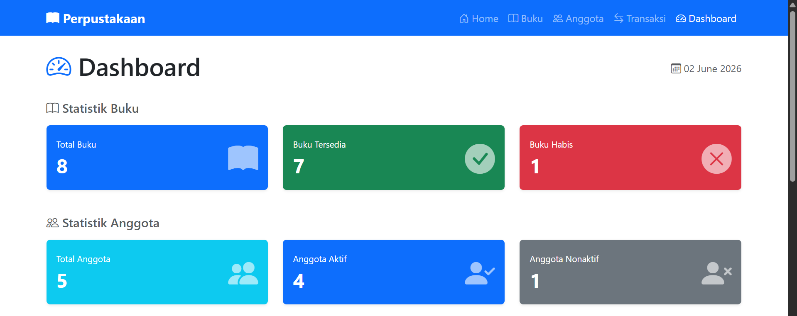
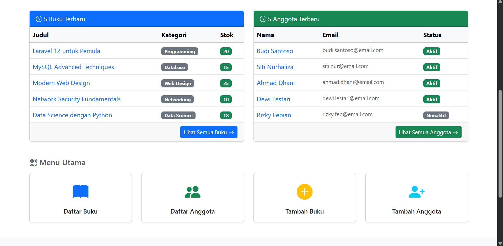
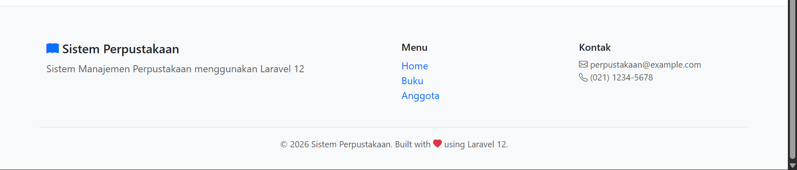
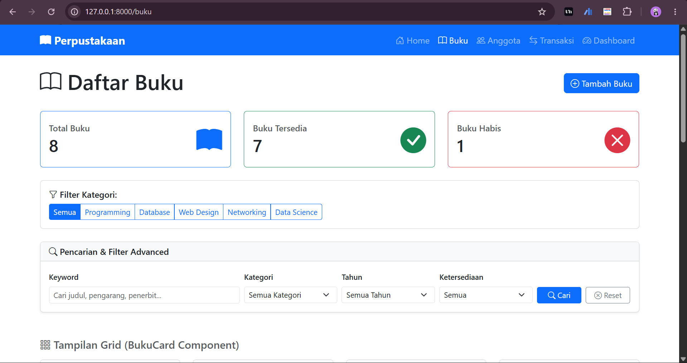
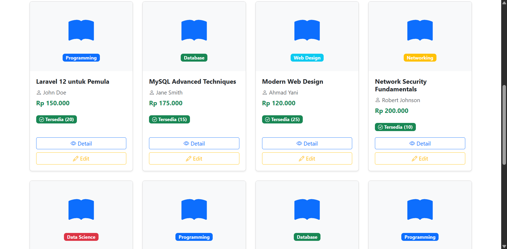
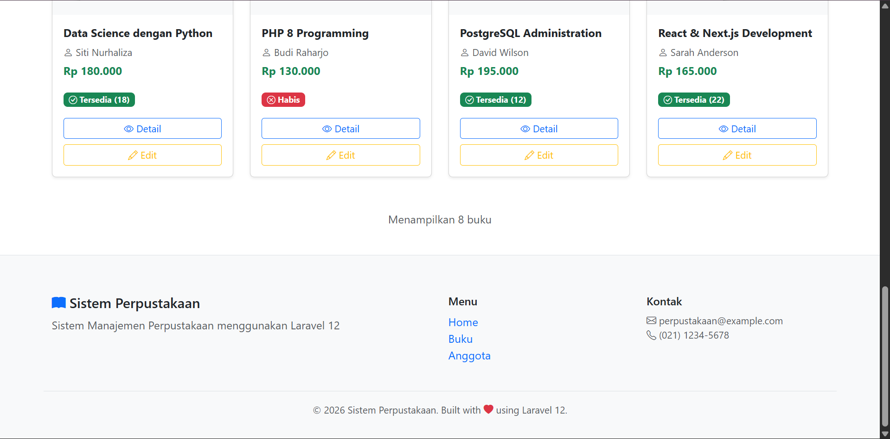
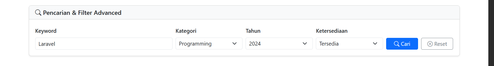
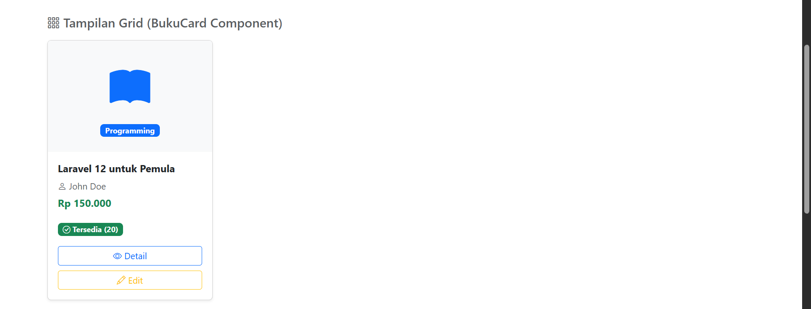

# Pertemuan 11 - Controller & View (MVC Pattern)

**Mata Kuliah:** Pemrograman Website 2  
**Kode MK:** INF2419  
**NIM:** 60324059  
**Nama:** Gathan Hilabi  
**Dosen:** Mohammad Reza Maulana, M.Kom  
**Universitas:** UIN K.H. Abdurrahman Wahid Pekalongan

---

## Deskripsi

Proyek ini merupakan implementasi Pertemuan 11 mata kuliah Pemrograman Website 2,
yaitu implementasi pola MVC (Model-View-Controller) di Laravel 13.
Fokus utama adalah pembuatan Controller, Blade Templating Engine, Blade Components,
dan fitur Search & Filter Advanced.
Studi kasus yang digunakan adalah Sistem Manajemen Perpustakaan.

---

## Tugas 1 — Halaman Dashboard (30%)

- [x] `DashboardController` dengan method `index()`
- [x] Route `/dashboard` terdaftar dengan nama `dashboard`
- [x] Statistik buku: Total Buku, Buku Tersedia, Buku Habis
- [x] Statistik anggota: Total Anggota, Anggota Aktif, Anggota Nonaktif
- [x] List 5 buku terbaru (tabel dengan link ke detail)
- [x] List 5 anggota terbaru (tabel dengan link ke detail)
- [x] Quick links ke menu utama (Daftar Buku, Daftar Anggota, Tambah Buku, Tambah Anggota)

---

## Tugas 2 — Blade Component BukuCard (40%)

- [x] Generate component dengan `php artisan make:component BukuCard`
- [x] Property `$buku` (object Buku)
- [x] Property `$showActions` (boolean, default `true`)
- [x] Tampilan card: cover icon, judul, pengarang, harga, stok
- [x] Badge kategori dengan warna dinamis menggunakan `match()`
- [x] Badge status ketersediaan (Tersedia / Habis)
- [x] Button Detail & Edit muncul hanya jika `$showActions = true`
- [x] Component digunakan di halaman `buku/index.blade.php` (tampilan grid)

---

## Tugas 3 — Search & Filter Buku Advanced (30%)

- [x] Method `search(Request $request)` di `BukuController`
- [x] Route `/buku/search` terdaftar dengan nama `buku.search`
- [x] Filter keyword (mencari di kolom `judul`, `pengarang`, `penerbit`)
- [x] Filter kategori (dropdown dinamis dari database)
- [x] Filter tahun terbit (dropdown dinamis dari database)
- [x] Filter ketersediaan (Semua / Tersedia / Habis)
- [x] Form search tampil di halaman `buku/index.blade.php`
- [x] Nilai filter tetap tampil (persistent) setelah form disubmit

---

## File yang Dibuat / Diubah

| File | Keterangan |
|------|------------|
| `app/Http/Controllers/DashboardController.php` | Controller dashboard — Tugas 1 |
| `resources/views/dashboard/index.blade.php` | View halaman dashboard — Tugas 1 |
| `app/View/Components/BukuCard.php` | Class Blade Component — Tugas 2 |
| `resources/views/components/buku-card.blade.php` | Template Blade Component — Tugas 2 |
| `app/Http/Controllers/BukuController.php` | Tambah method `search()` & update `index()` — Tugas 3 |
| `resources/views/buku/index.blade.php` | Tambah form search & grid component — Tugas 2 & 3 |
| `resources/views/layouts/navbar.blade.php` | Tambah link Dashboard di navbar |
| `routes/web.php` | Tambah route `/dashboard` dan `/buku/search` |

---

## Cara Menjalankan

### 1. Clone repo
```bash
git clone https://github.com/[USERNAME]/[NAMA-REPO].git
cd [NAMA-REPO]
```

### 2. Install dependencies
```bash
composer install
```

### 3. Setup environment
```bash
cp .env.example .env
php artisan key:generate
```

### 4. Konfigurasi database di `.env`
```env
DB_DATABASE=perpustakaan_laravel
DB_USERNAME=root
DB_PASSWORD=
```

### 5. Buat database di phpMyAdmin
Buat database baru bernama `perpustakaan_laravel`

### 6. Jalankan migration + seeder
```bash
php artisan migrate:fresh --seed
```

### 7. Jalankan server
```bash
php artisan serve
```

---

## URL Testing

| URL | Keterangan |
|-----|------------|
| `/dashboard` | Halaman dashboard — Tugas 1 ✅ |
| `/buku` | Daftar buku + form search + grid component |
| `/buku/search?keyword=laravel` | Pencarian buku by keyword — Tugas 3 ✅ |
| `/buku/search?kategori=Programming` | Filter by kategori — Tugas 3 ✅ |
| `/buku/search?ketersediaan=tersedia` | Filter buku tersedia — Tugas 3 ✅ |
| `/buku/search?tahun=2023` | Filter by tahun — Tugas 3 ✅ |
| `/buku/{id}` | Detail buku |
| `/anggota` | Daftar anggota |
| `/anggota/{id}` | Detail anggota |

---

## Screenshot

### Tugas 1 — Halaman Dashboard




### Tugas 2 — BukuCard Component (Grid View)




### Tugas 3 — Form Search & Filter Advanced


### Tugas 3 — Hasil Pencarian

