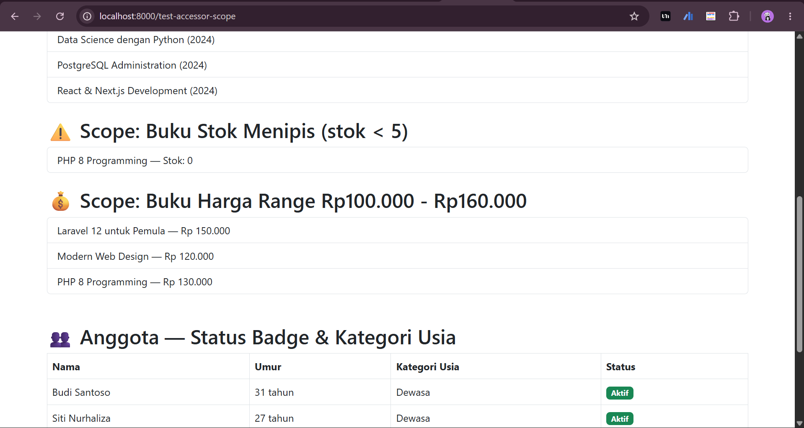
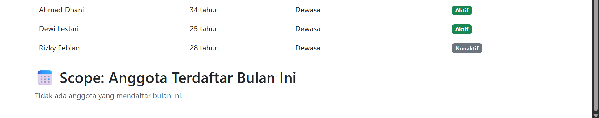

# Pertemuan 10 - Database dengan Migration & Model

**Mata Kuliah:** Pemrograman Website 2  
**Kode MK:** INF2419  
**NIM:** [60324059]  
**Nama:** [Gathan Hilabi]  
**Dosen:** Mohammad Reza Maulana, M.Kom  
**Universitas:** UIN K.H. Abdurrahman Wahid Pekalongan

---

## Deskripsi

Proyek ini merupakan implementasi Pertemuan 10 mata kuliah Pemrograman Website 2,
yaitu pengelolaan database menggunakan Laravel Migration dan Eloquent ORM.
Studi kasus yang digunakan adalah Sistem Manajemen Perpustakaan.

---

## Tugas 1 — Migration Tabel Kategori (40%)

- [x] Migration tabel `kategori` (id, nama_kategori, deskripsi, icon, warna, timestamps)
- [x] Model `Kategori` dengan `$fillable`
- [x] `KategoriSeeder` — 5 data kategori buku

---

## Tugas 2 — Model Accessor & Scope (60%)

### Model Buku
- [x] Accessor `status_stok_badge` — badge warna berdasarkan jumlah stok (Habis / Menipis / Sedang / Aman)
- [x] Accessor `tahun_label` — label Buku Baru / Buku Lama
- [x] Scope `stokMenipis()` — filter buku dengan stok < 5
- [x] Scope `hargaRange($min, $max)` — filter buku berdasarkan rentang harga
- [x] Scope `terbaru()` — filter buku dengan tahun_terbit >= 2024

### Model Anggota
- [x] Accessor `status_badge` — badge warna status Aktif / Nonaktif
- [x] Accessor `kategori_usia` — Remaja / Dewasa / Senior berdasarkan umur
- [x] Scope `jenisKelamin($jk)` — filter anggota berdasarkan jenis kelamin
- [x] Scope `terdaftarBulanIni()` — filter anggota yang mendaftar bulan ini

### Route Testing
- [x] `/test-accessor-scope` — menampilkan hasil semua accessor dan scope

---

## File yang Dibuat / Diubah

| File | Keterangan |
|------|------------|
| `database/migrations/xxxx_create_kategori_table.php` | Migration tabel kategori |
| `app/Models/Kategori.php` | Model Kategori |
| `database/seeders/KategoriSeeder.php` | Seeder data kategori |
| `database/seeders/DatabaseSeeder.php` | Registrasi semua seeder |
| `app/Models/Buku.php` | Tambah accessor & scope |
| `app/Models/Anggota.php` | Tambah accessor & scope |
| `routes/web.php` | Tambah route /test-accessor-scope |

---

## Cara Menjalankan

### 1. Clone repo
```bash
git clone https://github.com/[USERNAME]/[NAMA-REPO].git
cd [NAMA-REPO]
```

### 2. Install dependencies
```bash
composer install
```

### 3. Setup environment
```bash
cp .env.example .env
php artisan key:generate
```

### 4. Konfigurasi database di `.env`

### 5. Buat database di phpMyAdmin
Buat database baru bernama `perpustakaan_laravel`

### 6. Jalankan migration + seeder
```bash
php artisan migrate:fresh --seed
```

### 7. Jalankan server
```bash
php artisan serve
```

---

## URL Testing

| URL | Keterangan |
|-----|------------|
| `/buku` | Daftar semua buku |
| `/buku/{id}` | Detail buku |
| `/anggota` | Daftar semua anggota |
| `/anggota/{id}` | Detail anggota |
| `/test-query` | Testing scope dasar |
| `/test-accessor-scope` | Testing Tugas 2 ✅ |

---

## Screenshot

### Tabel Kategori di phpMyAdmin
)

### Hasil /test-accessor-scope
 )
