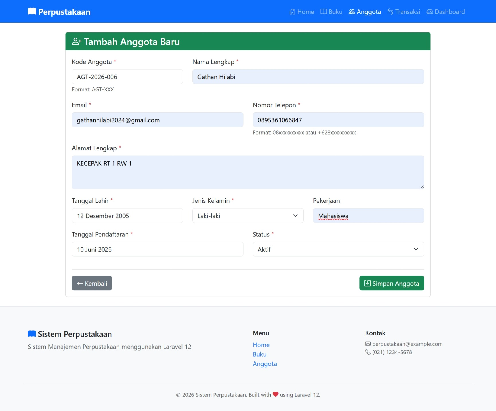
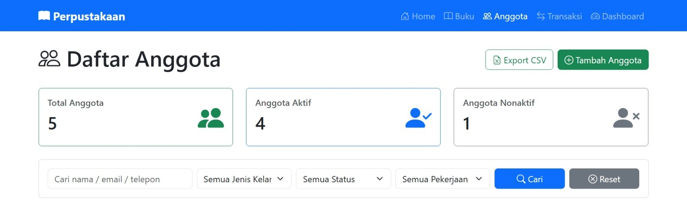
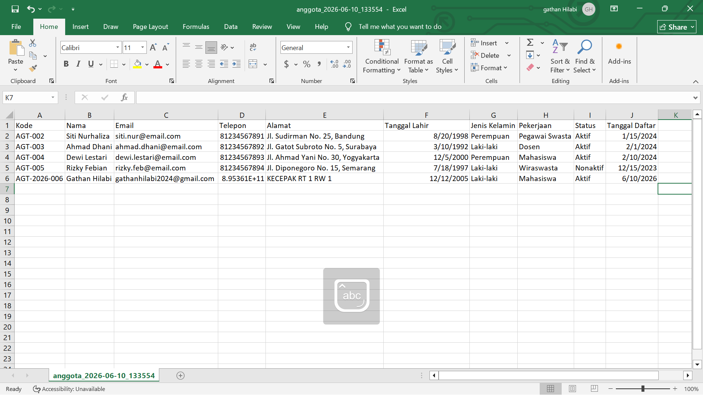
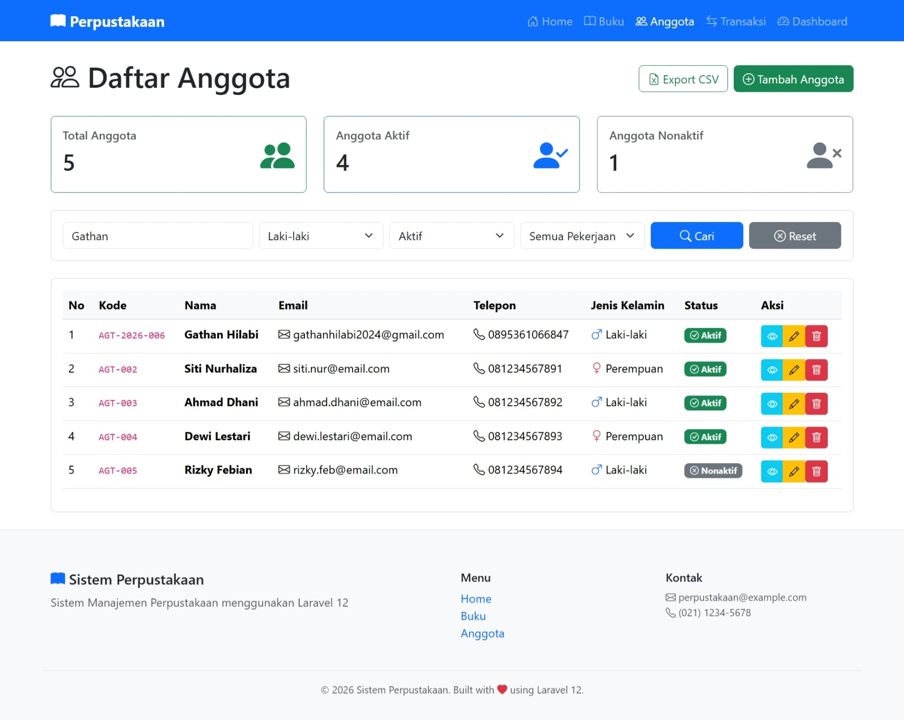
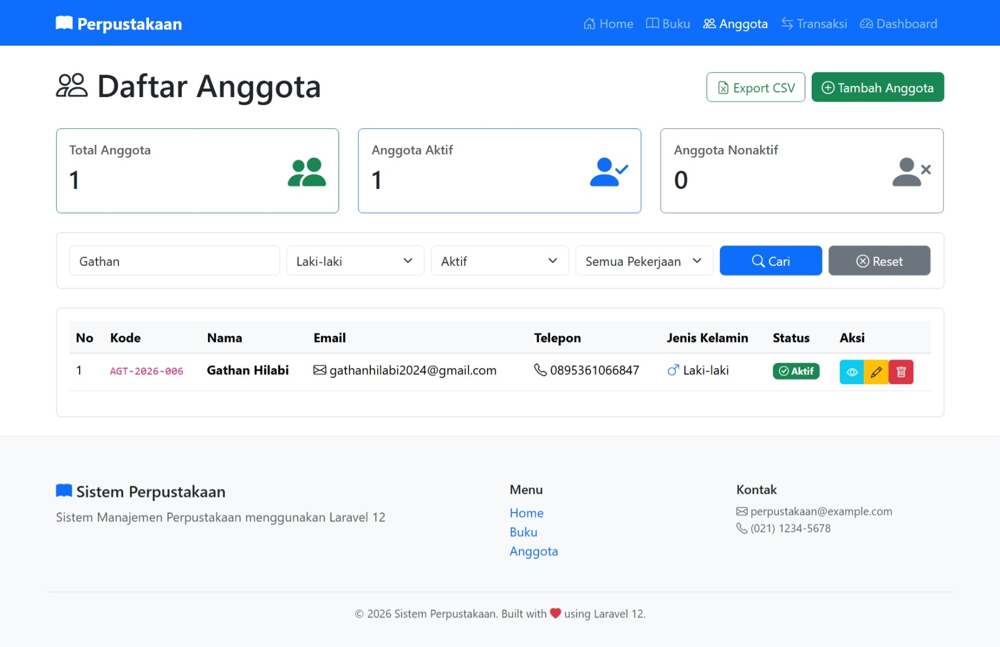

# Pertemuan 13 - CRUD Anggota Dengan Laravel

**Mata Kuliah:** Pemrograman Website 2  
**Kode MK:** INF2419  
**NIM:** 60324059  
**Nama:** Gathan Hilabi  
**Dosen:** Mohammad Reza Maulana, M.Kom  
**Universitas:** UIN K.H. Abdurrahman Wahid Pekalongan

---

## Deskripsi

Proyek ini merupakan implementasi Pertemuan 13 mata kuliah Pemrograman Website 2,
yaitu implementasi lengkap operasi CRUD (Create, Read, Update, Delete) untuk data anggota
perpustakaan menggunakan Laravel. Fokus utama adalah penerapan DRY Principle,
Advanced Form Validation untuk data personal (email, telepon, tanggal lahir),
Handle Date Input dengan Date Picker, serta fitur tambahan berupa
Auto-Generate Kode Anggota, Export CSV, dan Advanced Search & Filter.
Studi kasus yang digunakan adalah Sistem Manajemen Perpustakaan.

---

## Tugas 1 — Auto-Generate Kode Anggota (30%)

- [x] Helper function `generateKodeAnggota()` dibuat di `AnggotaController`
- [x] Format kode otomatis: `AGT-[TAHUN]-[NOMOR_URUT]` (contoh: `AGT-2026-001`)
- [x] Nomor urut dihitung berdasarkan anggota yang terdaftar di tahun yang sama
- [x] Jika belum ada anggota di tahun berjalan, nomor urut dimulai dari `001`
- [x] Kode anggota ditampilkan otomatis di form create (field `readonly`)
- [x] User tidak perlu mengisi kode anggota secara manual
- [x] Method `create()` diperbarui untuk meneruskan `$kodeAnggota` ke view

---

## Tugas 2 — Export Anggota ke CSV (40%)

- [x] Route `GET /anggota/export` terdaftar dengan nama `anggota.export`
- [x] Method `export()` di `AnggotaController` menghasilkan file CSV
- [x] Header kolom CSV: Kode, Nama, Email, Telepon, Alamat, Tanggal Lahir, Jenis Kelamin, Pekerjaan, Status, Tanggal Daftar
- [x] Nama file otomatis menggunakan timestamp: `anggota_YYYY-MM-DD_HHmmss.csv`
- [x] Tombol "Export CSV" tersedia di halaman daftar anggota
- [x] File langsung didownload tanpa disimpan di server (menggunakan `response()->stream()`)
- [x] Implementasi menggunakan Pure PHP (`fputcsv`) tanpa library eksternal

> **Catatan:** Package `maatwebsite/excel` dan `phpoffice/phpspreadsheet` tidak kompatibel
> dengan PHP 8.5.3 yang digunakan. Solusi alternatif menggunakan `fputcsv` bawaan PHP
> yang menghasilkan file CSV yang dapat dibuka langsung di Microsoft Excel.

---

## Tugas 3 — Advanced Search & Filter (30%)

- [x] Route `GET /anggota/search` terdaftar dengan nama `anggota.search`
- [x] Method `search()` di `AnggotaController` menangani pencarian dan filter
- [x] Filter berdasarkan keyword (nama / email / telepon) menggunakan `LIKE`
- [x] Filter berdasarkan jenis kelamin (Laki-laki / Perempuan)
- [x] Filter berdasarkan status (Aktif / Nonaktif)
- [x] Filter berdasarkan pekerjaan (Mahasiswa / Pegawai / Wiraswasta)
- [x] Form search tampil di atas tabel dengan tombol Cari dan Reset
- [x] Nilai filter tetap tampil di form setelah pencarian (menggunakan `request()`)
- [x] Statistik (total, aktif, nonaktif) ikut berubah sesuai hasil filter

---

## File yang Dibuat / Diubah

| File | Keterangan |
| ---- | ---------- |
| `app/Http/Controllers/AnggotaController.php` | Tambah method `export()`, `search()`, dan `generateKodeAnggota()` — Semua Tugas |
| `app/Http/Requests/StoreAnggotaRequest.php` | Form Request create anggota + validasi advanced — Praktikum |
| `app/Http/Requests/UpdateAnggotaRequest.php` | Form Request update anggota + ignore ID unique — Praktikum |
| `resources/views/anggota/index.blade.php` | Tambah tombol export CSV + form search & filter — Tugas 2 & 3 |
| `resources/views/anggota/create.blade.php` | Form tambah anggota + kode otomatis + date picker — Tugas 1 |
| `resources/views/anggota/edit.blade.php` | Form edit anggota + date picker — Praktikum |
| `resources/views/anggota/show.blade.php` | Detail anggota — Praktikum |
| `routes/web.php` | Tambah route `export` dan `search` untuk anggota |

---

## Struktur Folder Penting

```
perpustakaan-laravel/
│
├── app/
│   ├── Http/
│   │   ├── Controllers/
│   │   │   └── AnggotaController.php     ← CRUD + export() + search() + generateKodeAnggota()
│   │   └── Requests/
│   │       ├── StoreAnggotaRequest.php    ← Validasi tambah anggota
│   │       └── UpdateAnggotaRequest.php   ← Validasi edit anggota (ignore ID)
│   │
│   └── Models/
│       └── Anggota.php                    ← Eloquent Model + Accessor + Scope
│
├── database/
│   ├── migrations/
│   │   └── xxxx_create_anggota_table.php  ← Struktur tabel anggota
│   └── seeders/
│       └── AnggotaSeeder.php              ← Data dummy anggota
│
├── resources/
│   └── views/
│       ├── layouts/
│       │   └── app.blade.php              ← Layout utama + flash messages
│       └── anggota/
│           ├── index.blade.php            ← Daftar anggota + export + search
│           ├── create.blade.php           ← Form tambah anggota + kode otomatis
│           ├── edit.blade.php             ← Form edit anggota
│           └── show.blade.php             ← Detail anggota
│
└── routes/
    └── web.php                            ← Semua route aplikasi
```

---

## Cara Menjalankan

### 1. Clone repo

```bash
git clone https://github.com/G-than12/Tugas-13.git
cd Tugas-13
```

### 2. Install dependencies

```bash
composer install
```

### 3. Setup environment

```bash
cp .env.example .env
php artisan key:generate
```

### 4. Konfigurasi database di `.env`

```env
DB_DATABASE=perpustakaan_laravel
DB_USERNAME=root
DB_PASSWORD=
```

### 5. Buat database di phpMyAdmin

Buat database baru bernama `perpustakaan_laravel`

### 6. Jalankan migration + seeder

```bash
php artisan migrate:fresh --seed
```

### 7. Jalankan server

```bash
php artisan serve
```

---

## URL Testing

| URL | Method | Keterangan |
| --- | ------ | ---------- |
| `/dashboard` | GET | Halaman dashboard |
| `/anggota` | GET | Daftar anggota + export CSV + search |
| `/anggota/create` | GET | Form tambah anggota (kode otomatis) |
| `/anggota` | POST | Simpan anggota baru |
| `/anggota/{id}` | GET | Detail anggota |
| `/anggota/{id}/edit` | GET | Form edit anggota |
| `/anggota/{id}` | PUT | Update data anggota |
| `/anggota/{id}` | DELETE | Hapus anggota |
| `/anggota/export` | GET | Download data anggota sebagai CSV — Tugas 2 ✅ |
| `/anggota/search` | GET | Pencarian & filter anggota — Tugas 3 ✅ |

---

## Format Kode Anggota (Tugas 1)

Format yang dihasilkan otomatis: `AGT-[TAHUN]-[NOMOR_URUT]`

| Contoh | Keterangan |
| ------ | ---------- |
| `AGT-2026-001` | Anggota pertama tahun 2026 |
| `AGT-2026-002` | Anggota kedua tahun 2026 |
| `AGT-2026-010` | Anggota kesepuluh tahun 2026 |
| `AGT-2027-001` | Reset ke 001 di tahun berikutnya |

---

## Validasi Data Anggota

| Field | Aturan Validasi |
| ----- | --------------- |
| Kode Anggota | Required, unik, max 20 karakter |
| Nama | Required, max 100 karakter |
| Email | Required, format email valid, unik |
| Telepon | Required, format Indonesia (`08xx` / `+62xx`), 10-15 karakter |
| Alamat | Required |
| Tanggal Lahir | Required, format tanggal valid, harus sebelum hari ini |
| Jenis Kelamin | Required, hanya `Laki-laki` atau `Perempuan` |
| Pekerjaan | Opsional, max 50 karakter |
| Tanggal Daftar | Required, tidak boleh di masa depan |
| Status | Required, hanya `Aktif` atau `Nonaktif` |

---

## Penjelasan Tugas 2 — Export CSV

Fitur export menggunakan fungsi bawaan PHP `fputcsv` tanpa memerlukan library eksternal.
Pendekatan ini dipilih karena package `maatwebsite/excel` dan `phpoffice/phpspreadsheet`
tidak kompatibel dengan PHP 8.5.3.

### Cara Kerja

1. User klik tombol **"Export CSV"** di halaman daftar anggota
2. Request dikirim ke route `GET /anggota/export`
3. Controller mengambil seluruh data anggota dari database
4. Data ditulis ke `php://output` menggunakan `fputcsv` baris per baris
5. BOM UTF-8 ditambahkan di awal file agar karakter Indonesia terbaca benar di Excel
6. Nomor telepon diberi prefix `\t` agar Excel tidak mengubahnya menjadi notasi ilmiah
7. Tanggal lahir dan tanggal daftar diformat ke `d-m-Y` (contoh: `15-05-1995`)
8. File langsung terdownload ke komputer user tanpa disimpan di server

### Isi Kolom CSV

| Kolom | Contoh Data |
| ----- | ----------- |
| Kode | `AGT-2026-001` |
| Nama | `Gathan Hilabi` |
| Email | `gathan@example.com` |
| Telepon | `081234567890` |
| Alamat | `Jl. Contoh No. 1, Pekalongan` |
| Tanggal Lahir | `15-05-2000` |
| Jenis Kelamin | `Laki-laki` |
| Pekerjaan | `Mahasiswa` |
| Status | `Aktif` |
| Tanggal Daftar | `10-06-2026` |

### Potongan Kode Utama

```php
public function export()
{
    $anggotas = Anggota::all();
    $filename = 'anggota_' . date('Y-m-d_His') . '.csv';

    $headers = [
        'Content-Type'        => 'text/csv; charset=UTF-8',
        'Content-Disposition' => 'attachment; filename="' . $filename . '"',
    ];

    $callback = function () use ($anggotas) {
        $file = fopen('php://output', 'w');
        fprintf($file, chr(0xEF).chr(0xBB).chr(0xBF)); // BOM UTF-8

        fputcsv($file, ['Kode', 'Nama', 'Email', 'Telepon', ...]);

        foreach ($anggotas as $anggota) {
            fputcsv($file, [
                $anggota->kode_anggota,
                $anggota->nama,
                $anggota->email,
                "\t" . $anggota->telepon,       // prefix \t agar tidak jadi notasi ilmiah
                $anggota->alamat,
                $anggota->tanggal_lahir?->format('d-m-Y'),
                $anggota->jenis_kelamin,
                $anggota->pekerjaan,
                $anggota->status,
                $anggota->tanggal_daftar?->format('d-m-Y'),
            ]);
        }
        fclose($file);
    };

    return response()->stream($callback, 200, $headers);
}
```

---

## Penjelasan Tugas 3 — Advanced Search & Filter

Fitur search & filter memungkinkan admin mencari anggota berdasarkan beberapa kriteria
sekaligus tanpa reload halaman yang tidak perlu. Semua filter dapat dikombinasikan.

### Cara Kerja

1. User mengisi form search di atas tabel (keyword, jenis kelamin, status, pekerjaan)
2. Form dikirim via `GET` ke route `/anggota/search`
3. Controller membangun query Eloquent secara dinamis berdasarkan parameter yang diisi
4. Parameter yang kosong diabaikan (tidak mempengaruhi query)
5. Hasil ditampilkan di halaman yang sama (`anggota.index`)
6. Nilai filter tetap tampil di form setelah pencarian menggunakan `request('field')`
7. Statistik (total, aktif, nonaktif) ikut berubah sesuai hasil filter
8. Tombol **Reset** mengarahkan kembali ke `/anggota` untuk menampilkan semua data

### Filter yang Tersedia

| Filter | Tipe | Cara Kerja |
| ------ | ---- | ---------- |
| Keyword | Text input | Mencari di kolom `nama`, `email`, dan `telepon` menggunakan `LIKE %keyword%` |
| Jenis Kelamin | Dropdown | Filter exact match: `Laki-laki` atau `Perempuan` |
| Status | Dropdown | Filter exact match: `Aktif` atau `Nonaktif` |
| Pekerjaan | Dropdown | Filter exact match: `Mahasiswa`, `Pegawai`, atau `Wiraswasta` |

### Potongan Kode Utama

```php
public function search(Request $request)
{
    $query = Anggota::query();

    // Filter keyword — cari di nama, email, telepon sekaligus
    if ($request->keyword) {
        $query->where(function ($q) use ($request) {
            $q->where('nama', 'like', '%' . $request->keyword . '%')
              ->orWhere('email', 'like', '%' . $request->keyword . '%')
              ->orWhere('telepon', 'like', '%' . $request->keyword . '%');
        });
    }

    // Filter dropdown — hanya dijalankan jika nilainya tidak kosong
    if ($request->jenis_kelamin) {
        $query->where('jenis_kelamin', $request->jenis_kelamin);
    }
    if ($request->status) {
        $query->where('status', $request->status);
    }
    if ($request->pekerjaan) {
        $query->where('pekerjaan', $request->pekerjaan);
    }

    $anggotas = $query->latest()->get();

    // Statistik ikut berubah sesuai hasil filter
    $totalAnggota    = $anggotas->count();
    $anggotaAktif    = $anggotas->where('status', 'Aktif')->count();
    $anggotaNonaktif = $anggotas->where('status', 'Nonaktif')->count();

    return view('anggota.index', compact(
        'anggotas', 'totalAnggota', 'anggotaAktif', 'anggotaNonaktif'
    ));
}
```

---

## Screenshot

### Tugas 1 — Auto-Generate Kode Anggota



### Tugas 2 — Export CSV




### Tugas 3 — Advanced Search & Filter



