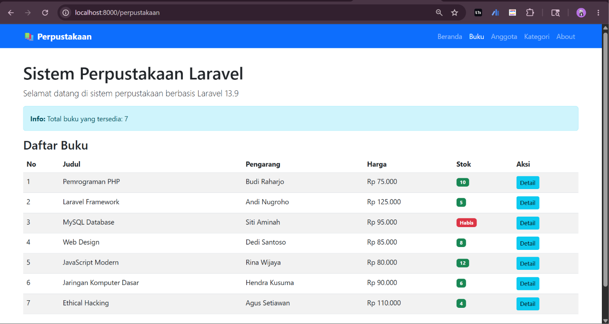
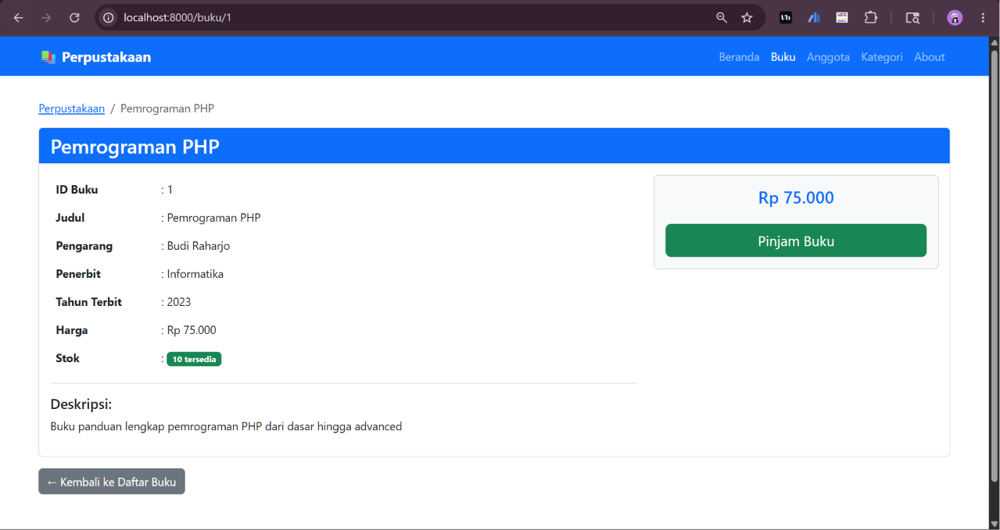
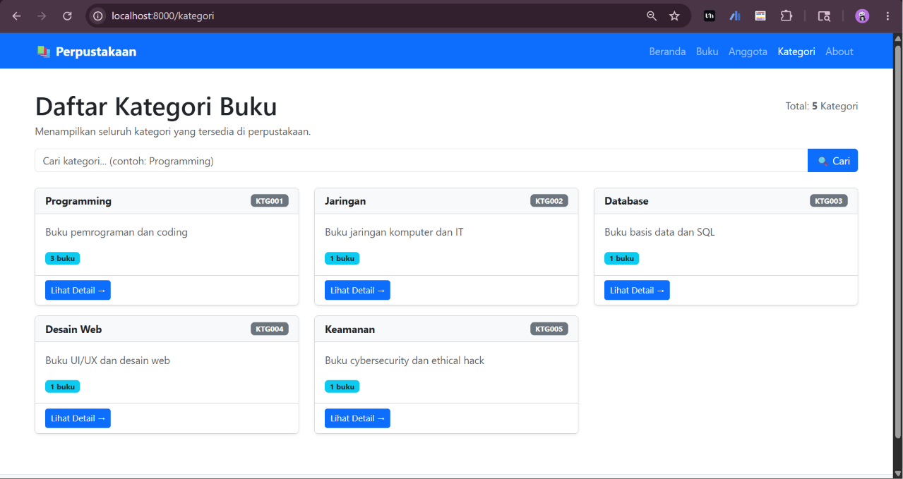
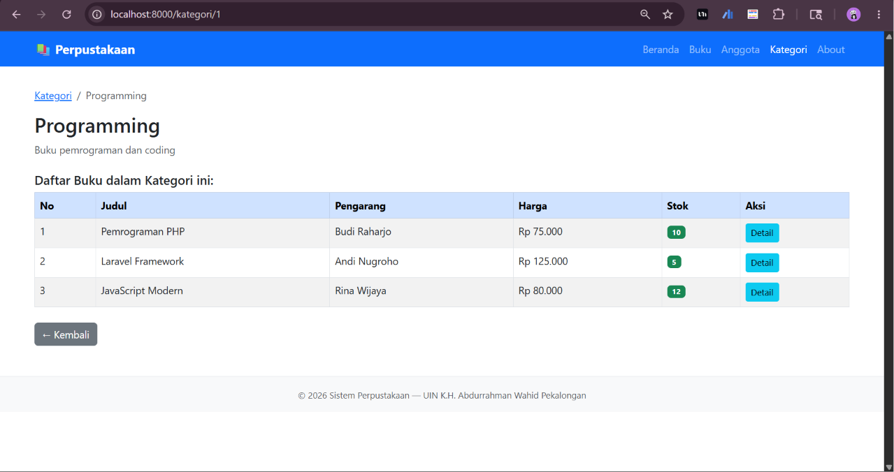
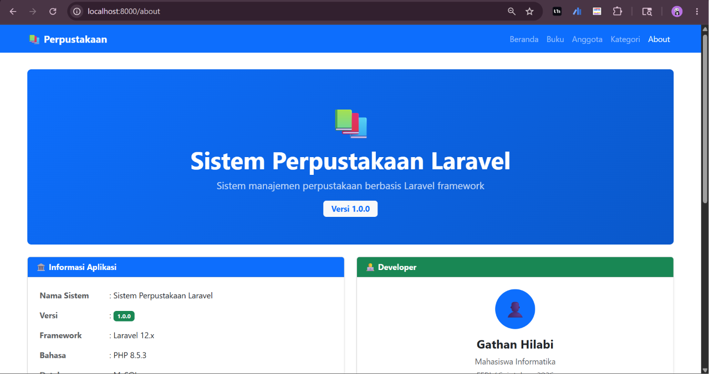
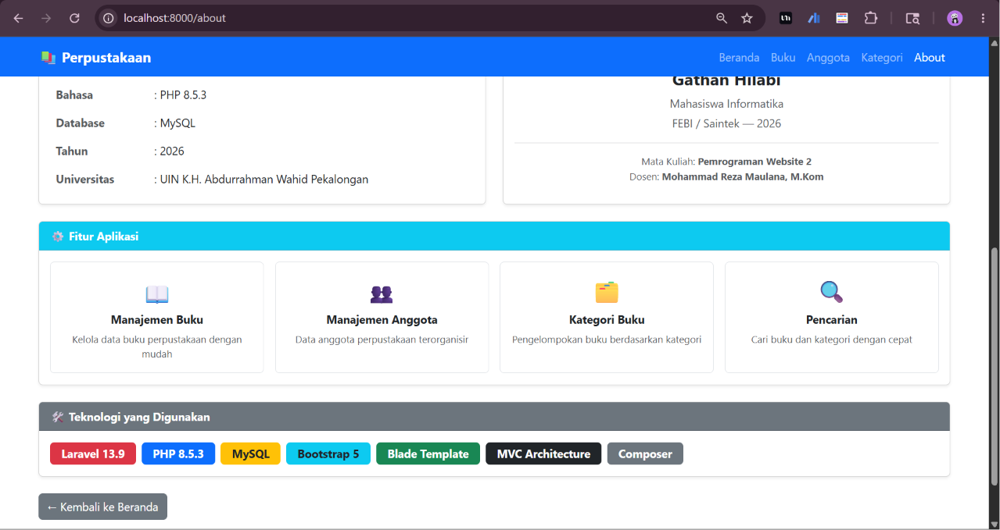

# 📚 Sistem Manajemen Perpustakaan — Laravel

> **Tugas Pertemuan 9: Pengenalan Framework Laravel & MVC**

---

## 🏫 Informasi Mata Kuliah

| Keterangan | Detail |
|---|---|
| **Mata Kuliah** | Pemrograman Website 2 |
| **Kode MK** | INF2419 |
| **Pertemuan** | 9 — Pengenalan Framework Laravel & MVC |
| **Dosen Pengampu** | Mohammad Reza Maulana, M.Kom |
| **Universitas** | UIN K.H. Abdurrahman Wahid Pekalongan |
| **Program Studi** | Informatika |
| **Semester** | Genap 2025/2026 |

---

## 👤 Identitas Mahasiswa

| Keterangan | Detail |
|---|---|
| **Nama** | Gathan Hilabi |
| **NIM** | 60324059 |
| **Kelas** | Pemrograman Web II (A) |

---

## 📋 Deskripsi Proyek

Proyek ini merupakan implementasi **Sistem Manajemen Perpustakaan** berbasis **Laravel 12** sebagai bagian dari tugas Pertemuan 9 mata kuliah Pemrograman Website 2. Sistem ini memperlihatkan penerapan arsitektur **MVC (Model-View-Controller)** menggunakan framework Laravel dengan fitur routing, Blade template engine, dan controller.

---

## ✅ Capaian Tugas

### Tugas 1 — Routing dan View untuk Anggota (40%)
- [x] Route `GET /anggota` — menampilkan daftar anggota
- [x] Route `GET /anggota/{id}` — menampilkan detail anggota
- [x] View `anggota/index.blade.php` — tabel daftar 5 anggota dengan Bootstrap 5
- [x] View `anggota/show.blade.php` — card profil detail anggota

### Tugas 2 — Controller untuk Kategori Buku (60%)
- [x] Generate `KategoriController` via Artisan
- [x] Method `index()` — daftar semua kategori
- [x] Method `show($id)` — detail kategori beserta daftar buku
- [x] Method `search($keyword)` — pencarian kategori
- [x] View `kategori/index.blade.php` — card per kategori + search bar
- [x] View `kategori/show.blade.php` — detail kategori + tabel buku
- [x] View `kategori/search.blade.php` — hasil pencarian

### Bonus — Master Layout (+10%)
- [x] Membuat `layouts/app.blade.php` sebagai master layout
- [x] Navbar sticky (`fixed-top`) di semua halaman
- [x] Semua view menggunakan `@extends('layouts.app')`
- [x] Menggunakan named routes (`route()`)

---

## 🗂️ Struktur Folder Proyek

```
perpustakaan/
├── app/
│   └── Http/
│       └── Controllers/
│           ├── DataBuku.php              ← Data terpusat buku
│           ├── KategoriController.php    ← Controller kategori (Tugas 2)
│           └── PerpustakaanController.php
├── resources/
│   └── views/
│       ├── layouts/
│       │   └── app.blade.php             ← Master layout (Bonus)
│       ├── anggota/
│       │   ├── index.blade.php           ← Daftar anggota (Tugas 1)
│       │   └── show.blade.php            ← Detail anggota (Tugas 1)
│       ├── kategori/
│       │   ├── index.blade.php           ← Daftar kategori (Tugas 2)
│       │   └── show.blade.php            ← Detail kategori (Tugas 2)
│       └── perpustakaan/
│           ├── index.blade.php
│           ├── show.blade.php
│           └── about.blade.php
└── routes/
    └── web.php                           ← Semua route
```

---

## 🚀 Cara Menjalankan Proyek

### Prasyarat
Pastikan sudah terinstall:
- PHP >= 8.2
- Composer
- MySQL (via XAMPP)
- Laravel 12

### Langkah Instalasi

**1. Clone repository**
```bash
git clone https://github.com/[username]/[nama-repo].git
cd [nama-repo]
```

**2. Install dependencies**
```bash
composer install
```

**3. Salin file environment**
```bash
cp .env.example .env
```

**4. Generate application key**
```bash
php artisan key:generate
```

**5. Konfigurasi database di `.env`**
```env
DB_CONNECTION=mysql
DB_HOST=127.0.0.1
DB_PORT=3306
DB_DATABASE=perpustakaan_laravel
DB_USERNAME=root
DB_PASSWORD=
```

**6. Buat database di phpMyAdmin**

Buka `http://localhost/phpmyadmin` → buat database baru: `perpustakaan_laravel`

**7. Jalankan migrasi**
```bash
php artisan migrate
```

**8. Jalankan development server**
```bash
php artisan serve
```

**9. Buka di browser**
```
http://localhost:8000
```

---

## 🌐 Daftar Route

| Method | URL | Controller / Closure | Nama Route | Keterangan |
|---|---|---|---|---|
| GET | `/` | Closure | — | Halaman beranda |
| GET | `/perpustakaan` | PerpustakaanController@index | `perpustakaan.index` | Daftar buku |
| GET | `/buku/{id}` | PerpustakaanController@show | `buku.show` | Detail buku |
| GET | `/about` | PerpustakaanController@about | `about` | Halaman about |
| GET | `/anggota` | Closure | `anggota.index` | Daftar anggota |
| GET | `/anggota/{id}` | Closure | `anggota.show` | Detail anggota |
| GET | `/kategori` | KategoriController@index | `kategori.index` | Daftar kategori |
| GET | `/kategori/{id}` | KategoriController@show | `kategori.show` | Detail kategori |

---

## 🖼️ Screenshot Hasil

### Halaman Daftar Buku (`/perpustakaan`)
> **

### Halaman Detail Buku (`/buku/1`)
> **

### Halaman Daftar Anggota (`/anggota`)
> **

### Halaman Detail Anggota (`/anggota/1`)
> **

### Halaman Daftar Kategori (`/kategori`)
> **

### Halaman Detail Kategori (`/kategori/1`)
> **

### Halaman About (`/about`)
> * *

---

## 🛠️ Teknologi yang Digunakan

| Teknologi | Versi |
|---|---|
| Laravel | 13.9 |
| PHP | 8.5.3 |
| MySQL | 8.0 |
| Bootstrap | 5.3 |
| Composer | 2.9.7 |

---

## 📝 Catatan

- Data buku, anggota, dan kategori masih menggunakan array statis (belum dari database), karena implementasi Eloquent ORM dan Migration akan dilakukan pada **Pertemuan 10**
- Arsitektur MVC sudah diterapkan: Controller mengelola logic, View menampilkan data, routing terpisah di `routes/web.php`
- Semua view menggunakan master layout (`layouts/app.blade.php`) untuk konsistensi tampilan

---

## 🔗 Referensi

- [Laravel 12 Documentation](https://laravel.com/docs/12.x)
- [Modul Pertemuan 9 — Pemrograman Web 2](https://modul-belajar.vercel.app/pemrograman-web-2/pertemuan/pertemuan-9)
- [Bootstrap 5 Documentation](https://getbootstrap.com/docs/5.3)
